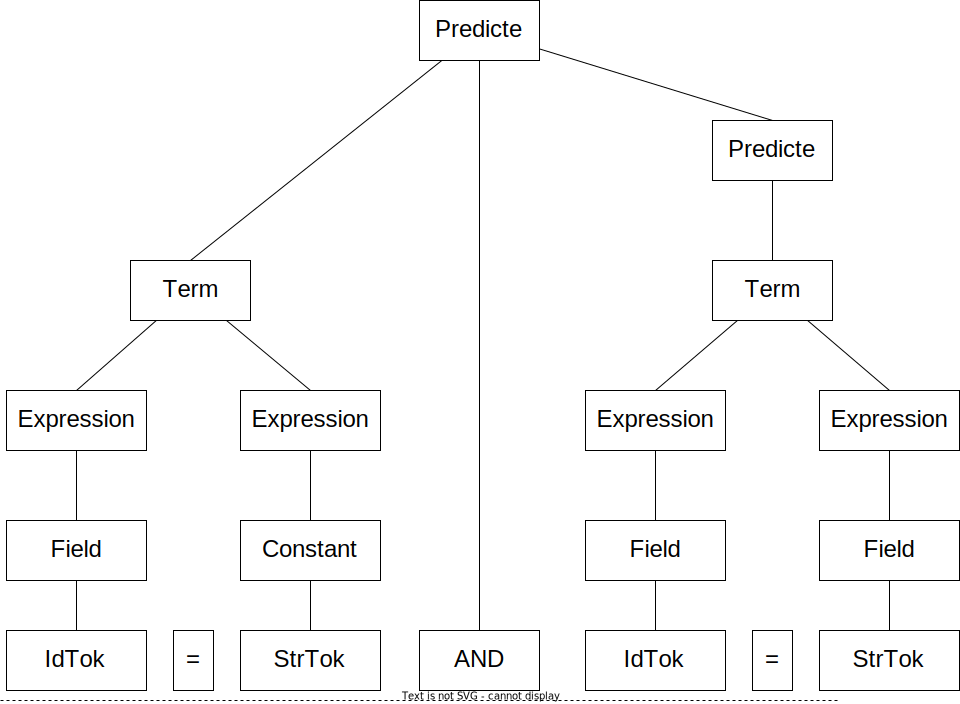

# Parser

SimpleDB.NETでのASTの生成を行うためのパーサーの仕様を示します。

## パーサーの仕様

Database design  and implementation の9.4 (p246)を参照のこと。

```math
\begin{equation}
\begin{aligned}
& \text{{<}Constant{>}} &&:= \text{StrTok}|\text{IntTok}
\\
& \text{{<}Expression{>}} &&:= \text{{<}Field{>}}|\text{{<}Constant{>}}
\\
& \text{{<}Term{>}}       &&:= \text{{<}Expression{>}} = \text{{<}Expression{>}}
\\
& \text{{<}Predicate{>}}  &&:= \text{{<}Term{>}} [\text{ AND {<}Predicate{>} } ]
\end{aligned}
\end{equation} 
```

```math
\begin{equation}
\begin{aligned}
& \text{{<}Query{>}} &&:= \text{SELECT} \: \text{{<}SelectList{>}}\: \text{FROM} \;\text{{<}TableList{>}} \: \text{[ WHERE {<}Predicate{>} ]}
\\
& \text{{<}SelectList{>}} &&:= \text{{<}Field{>}} \; [\;,\; \text{{<}SelectList{>} } ]
\\
& \text{{<}TableList{>}} &&:= \text{{<}Table{>}} \; [\;,\; \text{{<}TableList{>} } ]

\end{aligned}
\end{equation} 
```

```math
\begin{equation}
\begin{aligned}
& \text{{<}UpdateCmd{>}} &&:= \text{{<}Create{>}}\; | \; \text{{<}Delete{>}}\; | \; \text{{<}Modify{>}} | \; \text{{<}Insert{>}}
\\
& \text{{<}Create{>}} &&:= \text{{<}CreateTable{>}} | \text{{<}CreateIndex{>}} | \text{{<}CreateView{>}}
\\
& \text{{<}Delete{>}} &&:= \text{DELETE FROM} \: \text{IdTok} \: [\:\text{WHERE} \: \text{{<}Predicate{>}}\:]
\\
& \text{{<}Modify{>}} &&:= \text{UPDATE} \: \text{IdTok} \: \text{SET} \: \text{{<}Field{>}} = \text{{<}Expression{>}} \: [\:\text{WHERE} \: \text{{<}Predicate{>}} \:]
\\
& \text{{<}Insert{>}} &&:= \text{INSERT INTO} \: \text{IdTok} \:(\: \text{{<}FieldList{>}} \:) \: \text{VALUES} \: \text{{<}ConstList{>}}
\\
\end{aligned}
\end{equation} 
```

```math
\begin{equation}
\begin{aligned}
& \text{{<}CreateTable{>}} &&:= \text{CREATE TABLE} \: \text{IdTok} \: \text{(} \: \text{{<}FieldDefs{>}} \: \text{)}
\\
& \text{{<}CreateIndex{>}} &&:= \text{CREATE INDEX} \: \text{IdTok} \: \text{ON} \: \text{IdTok} \: \text{(} \: \text{{<}Field{>}} \: \text{)}
\\
& \text{{<}CreateView{>}} &&:= \text{CREATE VIEW} \: \text{IdTok} \: \text{AS} \: \text{{<}Query{>}}
\end{aligned}
\end{equation} 
```

```math
\begin{equation}
\begin{aligned}
& \text{{<}FieldDefs{>}} &&:= \text{{<}FieldDef{>}} \: [\;,\; \text{{<}FieldDefs{>} } ]
\\
& \text{{<}FieldDef{>}} &&:= \text{IdTok} \: \text{{<}TypeDef{>}}
\\
& \text{{<}TypeDef{>}} &&:= \text{INT} \: | \: \text{VARCHAR} \: \text{(} \: \text{IntTok} \: \text{)}
\end{aligned}
\end{equation} 
```

```math
\begin{equation}
\begin{aligned}

\end{aligned}
\end{equation} 
```


